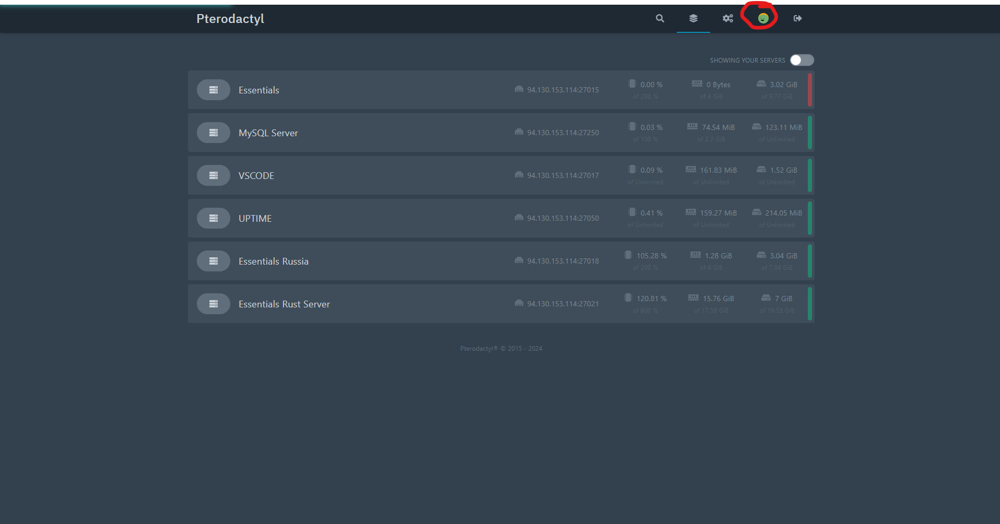

# **Pterodactyl APP**

## **Datos del Proyecto**

- **Título:** Pterodactyl App
- **Ciclo:** Desarrollo de Aplicaciones Multiplataforma
- **Curso:** 2º DAM
- **Fecha:** 17/06/2024
- **Centro:** 


### **Datos del Alumno**

- **Nombre:** Eduardo Catalán Mor
- **Correo electrónico:** educatalan02@gmail.com
  
    
<br>
<br>
<br>

<br><br>

# **Documento Descripción del Proyecto**

### **Contexto del Proyecto**

La aplicación que he desarrollado está construida utilizando Flutter de Google, una tecnología que permite crear aplicaciones multiplataforma de manera eficiente. Esta aplicación surge como una necesidad, ya que a pesar de que Pterodactyl, una plataforma de hosting de código abierto, ofrece una API para su gestión, actualmente no existe ninguna aplicación activa que permita acceder a esta plataforma desde dispositivos móviles.

He utilizado Visual Studio Code como entorno de desarrollo para construir esta aplicación. La decisión de hacerla de código abierto responde a la idea de hacerla accesible de forma gratuita para todos los usuarios. Con esta aplicación, cualquier persona podrá mantener su servidor de hosting abierto sin preocupaciones, ya que podrá acceder a él desde su dispositivo móvil, independientemente de su ubicación, utilizando redes WiFi o datos móviles.

Sin embargo, es importante destacar que durante la implementación la API de Pterodactyl me enfrenté a ciertas limitaciones. La API de Pterodactyl no está completamente documentada, lo que dificulta su comprensión y utilización al 100%. Aunque teóricamente es posible realizar todas las funciones que Pterodactyl permite a través de su API, su complejidad y falta de documentación han representado un desafío durante el desarrollo.

Durante el proceso de desarrollo, mis investigaciones se centraron principalmente en el uso de websockets para establecer la conexión con la aplicación y acceder a la funcionalidad ofrecida por Pterodactyl.

En resumen, esta aplicación representa un esfuerzo por hacer accesible la gestión de servidores de hosting a través de dispositivos móviles, aunque ha enfrentado desafíos debido a la complejidad y falta de documentación de la API subyacente.

<br>

### **Ámbito y Entorno**

El ámbito de este proyecto se sitúa en el contexto de la gestión de servidores de hosting a través de dispositivos móviles. Con el crecimiento exponencial de la demanda de servicios en la nube y la proliferación de aplicaciones y sitios web, la necesidad de una gestión eficiente de los servidores de hosting se ha vuelto cada vez más crucial. En este entorno, surge la necesidad de una solución que permita a los usuarios acceder y administrar sus servidores desde cualquier lugar y en cualquier momento, utilizando dispositivos móviles.

### **Análisis de la Realidad**

Actualmente, la mayoría de las plataformas de hosting ofrecen interfaces web para la gestión de servidores, lo que limita su accesibilidad y conveniencia. A pesar de que Pterodactyl, una plataforma de hosting de código abierto, proporciona una API para la gestión de servidores, no existe una aplicación móvil activa que permita a los usuarios acceder a esta funcionalidad desde sus dispositivos móviles. Esta brecha en el mercado ha generado la necesidad de una solución que proporcione una experiencia móvil intuitiva y conveniente para la gestión de servidores de hosting.

<br>

### **Solución y Justificación**

La solución propuesta consiste en el desarrollo de una aplicación móvil utilizando Flutter de Google, que permita a los usuarios acceder y administrar sus servidores de hosting a través de dispositivos móviles. Esta aplicación aprovechará la API proporcionada por Pterodactyl para ofrecer una amplia gama de funcionalidades, incluida la gestión de servidores, la monitorización del rendimiento y la configuración de opciones avanzadas.

La justificación de esta solución radica en la necesidad de ofrecer una experiencia de gestión de servidores más conveniente y accesible para los usuarios. Al proporcionar una aplicación móvil dedicada, los usuarios podrán acceder a sus servidores de hosting desde cualquier lugar y en cualquier momento, lo que aumentará su eficiencia y productividad. Además, al ser de código abierto y gratuito para todos, esta aplicación contribuirá a democratizar el acceso a la gestión de servidores de hosting, eliminando barreras de entrada y fomentando la participación en la comunidad de desarrollo.

### **Destinatarios**

Los destinatarios de esta aplicación son cualquier persona o entidad que gestione servidores de hosting a través de la plataforma Pterodactyl y desee acceder a esta funcionalidad desde dispositivos móviles. Esto incluye a administradores de sistemas, desarrolladores web, empresas de alojamiento, y cualquier persona que requiera una gestión remota y conveniente de sus servidores de hosting.


### **Objetivo del Proyecto**

El objetivo principal de este proyecto es proporcionar una solución real y efectiva para aquellos usuarios que deseen o necesiten acceder a la gestión de servidores de hosting a través de una aplicación móvil. Esto incluye tanto a administradores de sistemas y desarrolladores web como a empresas de alojamiento y cualquier otra entidad que requiera una gestión remota y conveniente de sus servidores.

Además, el proyecto tiene como objetivo ofrecer una funcionalidad adicional que permita a los usuarios gestionar servidores de distintos proveedores de paneles Pterodactyl desde la misma aplicación. Esto significa que los usuarios podrán agrupar y gestionar todos sus servidores de hosting, independientemente del proveedor, en una sola interfaz móvil unificada.

En resumen, el objetivo del proyecto es desarrollar una aplicación móvil que proporcione una solución integral para la gestión de servidores de hosting, tanto individualmente como en grupos, desde cualquier lugar y en cualquier momento, a través de dispositivos móviles.

<br><br><br><br><br><br><br><br><br><br>

### **Objetivo del Proyecto en Lengua Extranjera**

En entornos donde el idioma predeterminado no es ni español ni inglés, la proyección del proyecto se centra en garantizar una experiencia de usuario fluida y accesible. Aquí hay algunos aspectos clave de esta proyección:

1. **Idioma Predeterminado en Inglés**: Dado que el inglés es ampliamente utilizado como un idioma común en todo el mundo, se establece como el idioma predeterminado para usuarios cuyo idioma principal no sea ni español ni inglés. Esto asegura que puedan acceder a la aplicación y comprenderla de manera efectiva, incluso si no tienen acceso inmediato a su idioma nativo.

2. **Opción de Cambio de Idioma en Ajustes**: Aunque la aplicación se inicia en el idioma predeterminado del dispositivo, se proporciona una opción en los ajustes para que los usuarios puedan cambiar el idioma a su preferencia. Esto permite una mayor personalización y adaptación a las necesidades individuales de cada usuario.

3. **Consideración de la Usabilidad**: Se prioriza la usabilidad y la accesibilidad en el diseño de la interfaz de usuario para garantizar que los usuarios puedan navegar y utilizar la aplicación de manera intuitiva, independientemente del idioma en el que esté configurada.

4. **Compatibilidad con Diversos Idiomas**: Aunque la aplicación inicialmente se lanza en inglés y español, se prevé la posibilidad de agregar soporte para otros idiomas en futuras actualizaciones, lo que ampliará aún más su accesibilidad y utilidad para una audiencia global diversa.

En resumen, la proyección del proyecto en entornos que no son el español se enfoca en proporcionar una experiencia de usuario inclusiva y adaptable, con el inglés como idioma predeterminado y la opción de cambiar el idioma según las preferencias individuales de los usuarios. Esto asegura que la aplicación pueda ser utilizada eficazmente por una amplia variedad de usuarios en diferentes regiones y con distintos idiomas.
<br><br><br><br><br><br><br><br><br><br><br><br><br><br><br><br><br><br><br><br><br>

# **Documento de Acuerdo del Proyecto**

### **Requisitos Funcionales y No Funcionales**
#### **Requisitos Funcionales**
 1. Autenticación de Usuario
     - Permite a los usuarios identificarse mediante las API Keys proporcionadas por el panel Pterodactyl.
     - Recuerda las sesiones de autenticación.

 2. Múltiples Usuarios
     - Permite poner varios usuarios/credenciales.
     - Permite poner las credenciales de varias instalaciones pterodactyl a la vez desde la misma app.

 3. Gestión de Consola
     - Permite a los usuarios acceder y enviar comandos a la consola del servidor.
     - Debe mostrar en tiempo real la salida de la consola.
     - Wrapper de Códigos de Escape ANSI
         - Implementa un wrapper que interpreta los códigos de escape ANSI utilizados por Pterodactyl.
         - El wrapper traduce los códigos de colores ANSI a los colores equivalentes en Flutter, permitiendo que la salida de la consola mantenga su formato de colores original cuando se visualiza desde la app.
         - Esta funcionalidad asegura que los colores y estilos de texto utilizados en la consola web se reflejen correctamente en la app, mejorando la experiencia de usuario y facilitando la administración de los servidores.

 4. Gestión de Ficheros
     - Los usuarios pueden navegar por el sistema de archivos del servidor. (No es mediante FTP) 
     - Permite editar y eliminar archivos.
 5. Editor de Ficheros
     - Incluye un editor de ficheros integrado que automáticamente detecta el tipo de archivo (xml,json,yaml, etc.).
     - Dependiendo de la sintaxis del archivo detectado, el editor aplica un esquema de colores predefinido para resaltar la sintaxis de dicho fichero, mejorando la legibilidad y facilitando la edición de los ficheros.

<br><br><br><br><br>

 6. Visualización del Estado del Servidor
     - La aplicación muestra el estado actual del servidor (encendido,apagado).
     - Muestra estadísticas del servidor (CPU & Memoria).
 7. Control del Servidor
     - El usuario puede iniciar,detener y reiniciar el servidor desde la aplicación.
 8. Logs 
     - La aplicación permite al usuario acceder a los logs del servidor mediante el explorador de archivos.
 9.  Gestión de Bases de Datos
     - Permite la visualización de las credenciales de acceso.
   <br><br>
### **Requisitos NO Funcionales**
1. Gestión de ficheros
    - No permite descargar ficheros.
    - No permite operaciones bulk/múltiples.
2. Gestión de Bases de Datos
    - No permite la gestión de la base de datos.
3. Gestión de Schedules
    - No permite la gestión de Schedules/Programaciones.
4. Gestión de Parámetros de Inicio
    - No permite cambiar los parámetros de inicio del servidor.
  
<br><br>

### **Tareas**

#### **Fase de Análisis y Planificación**

  1. Revisión de Requisitos
    - Investigación sobre Pterodactyl y su API.
  2. Definición de Funcionalidades
    -  Edición de ficheros.
    -  Autenticación mediante API KEYS.
    -  Permite múltiples API KEYS (incluído diferentes instalaciones).
    -  Consola en vivo y usable.
    -  Visualización de directorios y ficheros.
    -  Eliminación de ficheros.
    -  Reiniciar/Iniciar el servidor.
    -  Multi lenguaje.
    -  Modo oscuro y modo claro.
<br><br><br><br><br><br><br><br><br><br><br><br>

#### **Fase de Desarrollo**
   3. Configuración  del Entorno de Desarrollo
       - Instalación y configuración de Android Studio, Flutter y Visual Studio Code.
       - Configuración de GIT & Github para controlar las versiones.
   4. Desarrollo de la conexión con la API
        - Implementación de métodos para autenticarse y realizar operaciones básicas con la API de Pterodactyl.
        - Pruebas iniciales de conectividad.
   5. Implementación de Funcionalidades Principales
        - Gestión de Consola:
            - Desarrollo del Wrapper para códigos de escape ANSI.
            - Traducción de colores ANSI a colores de Flutter.
            - Uso de Websockets para recibir la consola en tiempo real.
        - Gestión de Archivos:
            - Navegación por el sistema de archivos del servidor.
            - Implementación de operaciones CRUD (actualizar, leer, eliminar) en ficheros.
        - Control del Servidor:
            - Funcionalidades para iniciar, detener y reiniciar el servidor. 
   6. Implementación del Editor de Ficheros
        - Detección automática del tipo de archivo (XML, JSON, YAML, ETC...).
        - Aplicación de esquemas de colores predefinidos para la sintaxis.
  <br><br><br>
### **Fase de Pruebas**

   1. Desarrollo de Pruebas Unitarias:
        - Pruebas específicas para verificar la correcta funcionalidad de la conexión con la API de Pterodactyl.
            - Resultado: APTO 
        - Verificación del correcto funcionamiento del wrapper de códigos de escape ANSI.
            - Resultado: APTO
2. Desarrollo de pruebas de Integración:
    - Creación de pruebas que verifican la interacción entre los módulos de la aplicación. (Consola, Gestor de ficheros a través de la API).
        - Resultado: APTO
    - Verificación de la correcta interpretación y traducción de códigos de escape ANSI.
        - Resultado: APTO
3. Desarrollo de Pruebas de Sistema:
    - Pruebas de principio a fin, que cubren todas las funcionalidades de la app, desde la autenticación hasta la gestión de servidores y edición de archivos.
        - Resultado: APTO
4. Desarrollo de Pruebas de Rendimiento:
    - Evaluado el rendimiento de la aplicación, sobre todo con los websockets. Asegurando que no se abre varias veces la misma conexión.
        - Resultado: APTO
5. Desarrollo de Pruebas de Interfaz de Usuario:
    - Comprobado que la aplicación responde sin delay. (Depende de la conexión a Internet)
        - Resultado: APTO


       


      
### **Presupuesto**

#### Coste de Programador Junior
 - Tarifa Horaria de Programador Junior: 15€/hora.
 - Total Horas de Trabajo: 87 horas.
 - Coste Total del Trabajo del Programador: 87 horas x 15€/hora = 1305€

#### Coste de Equipos y Cursos
 - Coste de la Tablet: 200€
 - Coste del Cursillo: 15€

#### Coste Total:
 - Coste Total del Programador: 1305€
 - Coste total de la Tablet y Cursillo: 200€ + 15€ = 215€

### **Resumen del Presupuesto**
 - Trabajo del Programador Junior: 1305€
 - Tablet: 200€
 - Cursillo Udemy: 15€
 - **Total: 1305€ + 215€ = 1520€**


### **Análisis de Riesgos**

El desarrollo de la aplicación móvil para la gestión de servidores a través de la API de Pterodactyl ha presentado ciertos desafíos y riesgos. Los principales riesgos identificados fueron:

1. **Entender la API de Pterodactyl**:
    - **Riesgo**: La documentación de la API de Pterodactyl es escasa, lo que dificulta la comprensión y correcta implementación de sus funcionalidades.
    - **Mitigación**: Realización de pruebas continuas para asegurar el correcto funcionamiento de las llamadas a la API.

2. **Aplicación de la API de Pterodactyl**:
    - **Riesgo**: Aplicar correctamente las funcionalidades de la API en la aplicación móvil.
    - **Mitigación**: Desarrollo modular de la aplicación, permitiendo realizar pruebas unitarias e integrales de cada módulo para asegurar su correcto funcionamiento.
<br><br><br><br>
3. **Escalabilidad de la Aplicación**:
    - **Riesgo**: La necesidad de que la aplicación sea escalable para futuras expansiones sin necesidad de grandes modificaciones en el código existente.
    - **Mitigación**: Diseño modular de la aplicación, facilitando la adición de nuevas funcionalidades de Pterodactyl sin necesidad de tocar el código existente. Uso de buenas prácticas de programación y patrones de diseño que promuevan la escalabilidad.

### **Estrategias de Mitigación**

- **Modularidad**: La aplicación ha sido desarrollada de manera modular, lo que permite añadir nuevas funcionalidades o realizar cambios sin afectar el resto del código.
- **Pruebas Continuas**: Realización de pruebas continuas durante todo el proceso de desarrollo para identificar y corregir errores de manera temprana. Incluye prueba y error hasta hacer funcionar todo.

### **Conclusión**

A pesar de los riesgos y desafíos presentados, se han implementado estrategias efectivas para mitigar estos riesgos, logrando una aplicación funcional y escalable. El enfoque modular asegura que futuras ampliaciones y mejoras puedan realizarse de manera eficiente y sin contratiempos.


## Documento de Análisis y Diseño


### Modelo de datos Panel
```dart
class Panel {
  late int id = 0;
  late String panelUrl;
  late String apiKey;
  late String name = '';

  Panel({
    required this.panelUrl,
    required this.apiKey,
    required this.name,
  });

  Map<String, dynamic> toMap() {
    return {
      'panelUrl': panelUrl,
      'apiKey': apiKey,
      'name': name,
    };
  }
}
```
<br><br>
El modelo de datos `Panel` representa la configuración de un panel en la aplicación, y sus atributos principales son:
 - **id:** Identificador único del panel (se inicializa en 0 por defecto).
 - **panelUrl:** URL del panel de administración de Pterodactyl.
 - **apiKey:** Clave de API para autenticarse y realizar operaciones a través de la API de Pterodactyl.
 - **name:** Nombre del panel. 

 #### **Métodos**

- Constructor: El constructor requiere `panelUrl`,`apiKey` y `name` como parámetros para crear una instancia del panel.
- toMap(): Convierte la instancia del panel en un mapa de claves y valores, lo cual me sirve para guardarlo en SQLite.

<br>

### Modelo de datos ServerState

```dart
class ServerState {
  ServerPowerState state;

  late ValueNotifier<ServerPowerState> stateNotifier = ValueNotifier(state);

  Server server;

  Panel panel;

  ServerState({required this.state, required this.server, required this.panel});
}
```
El modelo de datos `ServerState` representa el estado del servidor y sus atributos para poder acceder a la información a través de la API.

 - **state:** Representa el estado del servidor ('ServerPowerState'), (Iniciado,Parado,etc...).
 - **stateNotifier::** Es el notificador de valores para el estado del servidor, premite actualizar la interfaz de usuario en respuesta a cambios en el estado.
 - **server:** Objeto que representa al servidor. (Proviene de la librería Dartactyl)
 - **panel:** Objeto `Panel` que contiene la configuración del panel de administración.


### **Análisis y Diseño del Sistema Funcional**
La aplicación se ha construido usando el framework GetX y sigue la metodología MVC (Modelo-Vista-Controlador). A continuación, se presenta un ejemplo de cómo se ha implementado la actualización del contenido mediante `Obx` de GetX, lo cual permite que las interfaces (UI) se actualicen automáticamente cuando las variables observables cambian.

<br>

#### **Implementación de la Vista con GetX**
```dart
return Scaffold(
  appBar: AppBar(
    title: const Text('Pterodactyl App'),
    actions: [
      IconButton(
        icon: const Icon(Icons.settings),
        onPressed: () {
          Get.to(const AppSettings());
        },
      ),
    ],
  ),
  body: Center(
    child: Obx( // Observable de GetX
      () => ListView.builder(
        itemCount: serverController.panels.length,
        padding: EdgeInsets.symmetric(
          horizontal: MediaQuery.of(context).size.width * 0.03,
          vertical: 10,
        ),
        itemBuilder: (BuildContext context, int index) {
          return SizedBox(
            child: Card(
              child: ListTile(
                leading: const Icon(
                  Icons.cloud,
                ),
                title: Text(
                  serverController.panels[index].name,
                ),
                subtitle: Text(
                  serverController.panels[index].panelUrl,
                ),
                onTap: () {
                  Get.to(() => Servers(
                    panel: serverController.panels[index],
                  ));
                },
                onLongPress: () {
                  Get.to(() => EditServerScreen(
                    panel: serverController.panels[index],
                  ));
                },
              ),
            ),
          );
        },
      ),
    ),
  ),
  floatingActionButton: FloatingActionButton(
    child: const Icon(Icons.add),
    onPressed: () {
      Get.to(() => AddServer());
      serverController.fetchPanels(); // Actualiza la lista de servidores después de añadir un nuevo servidor
    },
  ),
);
```
#### **Explicación del Código**
 - AppBar:
    - Contiene el título de la aplicación y un botón de configuración que navega a la pantalla de configuraciones.
- Body: 
    - Utiliza `Obx` para observar cambios en `serverController.panels`. Cuando la lista de servidores cambia, la vista se actualiza automáticamente.
    - `ListView.builder` genera una lista de paneles con elementos interactivos (`ListTile`).
- ListTile:
    - Muestra el nombre y la URL del panel.
    - Tiene dos interacciones:
        - onTap: Navega a la pantalla de servidores (`Servers`) con el panel seleccionado.
        - onLongPress: Navega a la pantalla de edición del servidor (`EditServerScreen`) con el panel seleccionado.
- FloatingActionButton:
    - Al presionarlo, navega a la pantalla de añadir un nuevo servidor (`AddServer`) y actualiza la lista de paneles (`serverController.fetchPanels`).

<br><br><br><br><br><br><br><br><br><br><br><br><br><br><br><br><br><br>

### **Implementación del Controlador con GetX**

```dart
class PanelController extends GetxController {
  var panels = <Panel>[].obs; // observable para el Obx()

  @override
  void onInit() {
    super.onInit();
    fetchPanels();
  }

  void fetchPanels() async {
    final Database db = await openDatabase(
      join(await getDatabasesPath(), 'panel_apis.db'),
    );

    final List<Map<String, dynamic>> maps = await db.query('panel_apis');

    panels.value = List.generate(maps.length, (i) {
      return Panel(
        panelUrl: maps[i]['panel'],
        apiKey: maps[i]['apiKey'],
        name: maps[i]['name'],
      );
    });
  }
}
```
#### **Explicación del Código**
 - Clase `PanelController`:
    - Extiende `GetxController` para gestionar el estado de los paneles.
    - `panels`: Es una lista observable de tipo `Panel`, que se actualiza automáticamente cuando cambia su contenido.
- Método `onInit`:
    - Llama a `fetchPanels()` cuando se inicializa el controlador. Esto asegura que los paneles se carguen al inicio de la aplicación.
- Método `fetchPanels()`:
    - `async`: Indica que es una función asíncrona que realiza operaciones de E/S.
    - Abre una base de datos SQLite llamada `panel_apis.db` ubicada en el directorio de bases de datos predeterminado del dispositivo.
    - Ejecuta una consulta para obtener todos los registros de la tabla `panel_apis`.
    - Convierte los resultados de la consulta en objetos `Panel` y los asigna a `panels.value`, lo que automáticamente notifica a los widgets que dependen de `panels` para que se actualicen.

<br><br><br>

### **Conclusión de GetX**

El uso de GetX y la metodología MVC me ha permitido desarrollar una app estructurada y mantenible, con una interfaz de usuario reactiva y una navegación eficiente. Esta combinación de tecnologías me asegura que la aplicación pueda adaptarse fácilmente a futuras necesidades y cambios.


### **Wrapper de ANSI**
He implementado un wrapper personalizado para manejar códigos de escape ANSI en Flutter utilizando una expresión regular (`RegEx`) que detecta los códigos de escape ANSI con la siguiente expresión: `r'\x1B\[\d+m'`.
Posteriormente, he creado un widget personalizado que renderiza texto con colores dependiendo de los códigos de escape de ANSI presentes en el texto. Esta solución la he desarrollado por la falta de librerías en Flutter que soporten directamente la representación de widgets de texto con códigos de escape ANSI. Las librerías disponibles generalmente se limitan a mostrar texto con códigos de escape ANSI en la consola de depuración, sin soporte para widgets de texto en la interfaz de usuario de Flutter.


### **Tecnologías/Herramientas Usadas**

Durante el desarrollo de la aplicación Pterodactyl App, se han utilizado diversas tecnologías y herramientas para garantizar un desarrollo eficiente y efectivo:


  
- **Dart**: Lenguaje de programación utilizado en Flutter para escribir el código de la lógica de la aplicación y de la interfaz de usuario.

- **MVC (Modelo-Vista-Controlador)**: Metodología de diseño de software utilizada para separar la lógica de negocio (Controlador), la presentación (Vista) y los datos (Modelo), facilitando la organización y mantenimiento del código.

- **GitHub Desktop y Git**: Herramientas de control de versiones utilizadas para gestionar el código fuente, realizar seguimiento de cambios y colaborar en equipo a través de repositorios en GitHub.

- **Android Studio y Visual Studio Code**: Entornos de desarrollo integrados (IDEs) ampliamente utilizados para desarrollar aplicaciones Flutter/Dart, proporcionando herramientas avanzadas de depuración, edición y gestión de proyectos.

- **JavaScript**: Utilizado para probar y interactuar con la API de Pterodactyl, aprovechando su versatilidad y facilidad de integración en aplicaciones web y scripts de prueba.

<br><br><br><br><br><br><br><br><br><br><br><br><br>

- **Flutter**: Framework de Google para construir interfaces de usuario nativas multiplataforma en dispositivos móviles, web y escritorio desde un solo código base.
    - Librerías usadas:
        - cupertino_icons: ^1.0.2
        - web_socket_channel: ^2.4.0
        - http: ^1.2.0
        - flutter_hooks: ^0.20.5
        - socket_io_client: ^2.0.3+1
        - sqflite: ^2.3.2
        - sqflite_common_ffi: ^2.3.2+1
        - path: ^1.8.3
        - shimmer: ^3.0.0
        - provider: ^6.1.2
        - flex_color_scheme: ^7.3.1
        - get: ^4.6.6
        - get_storage: ^2.1.1
        - another_flutter_splash_screen: ^1.2.0
        - animated_tree_view: ^2.2.0
        - dio: ^5.4.2+1
        - path_provider: ^2.1.2
        - adaptive_theme: ^3.6.0
        - flex_seed_scheme: ^1.5.0
        - dartactyl: ^1.9.0
        - awesome_icons: ^1.1.0
        - line_awesome_flutter: ^2.0.0
        - persistent_bottom_nav_bar: ^5.0.2
        - ansix: ^0.3.2
        - logger: ^2.2.0
        - google_fonts: ^6.2.1
        - custom_navigation_bar: ^0.8.2
        - code_editor: ^2.1.0
        - flutter_code_editor: ^0.3.1
        - highlight: ^0.7.0
        - flutter_highlight: ^0.7.0
        - timeago: ^3.6.1
        - url_launcher: ^6.3.0

Estas tecnologías y herramientas han sido fundamentales para el desarrollo exitoso de Pterodactyl App, asegurando una aplicación robusta, eficiente y fácil de mantener.

<br><br><br><br>

## **Documento de Cierre**

### **Documento de Instalación y Configuración**

Para comenzar a trabajar con la aplicación Pterodactyl App, es necesario configurar adecuadamente el entorno de desarrollo. A continuación se detallan los pasos necesarios:

1. **Instalación de Herramientas**

   - **Flutter**: Instalar Flutter es el primer paso. Puedes seguir las instrucciones detalladas en [flutter.dev](https://flutter.dev/docs/get-started/install) para tu sistema operativo específico.
   
   - **Android Studio / Visual Studio Code**: Se recomienda utilizar Android Studio o Visual Studio Code como entornos de desarrollo integrados (IDEs) para Flutter. Ambos son compatibles con Flutter y ofrecen herramientas avanzadas para el desarrollo de aplicaciones móviles. (Android Studio es obligatorio para tener Android SDK).
   
   - **Git**: Git se utiliza para la gestión de versiones del código fuente. Instala Git desde [git-scm.com](https://git-scm.com/downloads) si aún no lo tienes.

2. **Configuración del Proyecto**

   - Clona el repositorio de GitHub de Pterodactyl App usando Git:
     ```bash
     git clone https://github.com/educatalan02/pterodactyl_app.git
     ```

   - Abre el proyecto en tu IDE preferido (Android Studio o Visual Studio Code).

3. **Instalación de Dependencias**

   - Ejecuta el siguiente comando en la terminal dentro del directorio de tu proyecto para instalar todas las dependencias especificadas en `pubspec.yaml`:
     ```bash
     flutter pub get
     ```

### **Configuración de la Aplicación**

Una vez que el entorno de desarrollo esté configurado, solo hay que iniciar la aplicación Pterodactyl App:

```bash
flutter run
```
     
<br><br><br>
  
# **Manual de Usuario**

## **Creamos una API Key en un Panel Pterodactyl**

Accedemos a un hosting Pterodactyl y navegamos hacia nuestro perfil.



Navegamos hasta el TAB `API Credentials`.


<br><br>
<br><br><br><br>


Ponemos un alias a la API KEY, en el parámetro `description` y clickamos en `CREATE`.


Ahora nos aparecerá nuestra API KEY. (Guardarla porque no se puede visualizar otra vez).


<br><br><br><br><br><br><br><br><br><br><br>


## **Abrimos la app en nuestro dispositivo**

Abrimos la aplicación, por defecto viene en inglés.


Clickamos en ajustes


<br><br><br>
<br><br><br>

Aquí cambiamos el modo oscuro/claro.


Modo oscuro


<br><br><br><br><br><br><br><br>

Idioma de la App


Desde la pantalla inicial le damos al botón de añadir panel.


Rellenamos todos los credenciales obtenidos de Pterodactyl.


<br><br><br><br><br><br>

Después de añadir el panel, clickamos en el panel añadido.


Aquí tenemos los servidores que contiene dicho panel con las credenciales.


<br><br><br><br><br><br><br>

Podemos añadir servidores a favoritos, y aparecerán siempre en la sección de arriba.


El icono de la derecha significa el estado actual del servidor (Se actualiza cada 15 segundos por motivos de rendimiento).


<br><br><br><br><br><br><br><br><br><br><br><br><br><br><br>

Accedemos al servidor, pulsando el mismo.

Aqui muestra la consola en tiempo real, usando el wrapper ansi para los colores.


Escribimos un comando y le damos al botón de enviar.


Aqui los consumos del servidor en tiempo real.


Aqui los botones, cuando solo está el de Reiniciar. Significa que hay un proceso de inicio/cierre ejecutándose. (En este caso se muestra el de Iniciar, porque el servidor está apagado.)


Deslizamos hacia la derecha la pantalla, y nos lleva al TAB `Archivos`


Entramos en la carpeta `Logs` al clickar encima.


<br><br><br>

Le damos a los 3 puntitos de un fichero. Y salen 2 opciones, eliminar archivo y descargar (Descargar no funciona).


Le damos a eliminar.


(Hay que salir del directorio y entrar de nuevo para notar los cambios)


<br><br><br><br><br><br><br><br><br><br><br><br><br><br><br><br>

Vamos atrás con la flechita hacia arriba.
Y nos devuelve a una ruta anterior.
Ahí clickamos en un fichero y nos lo abre para editarlo/leerlo.


Si escribimos, se guarda instantáneamente.


Salimos, y buscamos un fichero XML y otro JSON para observar el formato y la sintáxis que muestra el editor.


Ahora salimos del editor, y nos vamos al TAB `Más acciones`.
Ahí tenemos dos opciones, si clickamos en Bases de Datos, veremos información de conexión sobre las bases de datos asignadas al servidor.


En este caso, existe una base de datos. Si pulsamos encima se abre un menú con la información.


Al pinchar en uno de los datos, se copia dicha info en el portapapeles.


Si le damos al botón de eliminar, aparece un diálogo para confirmar. De esta manera preveemos de missclicks.


Si salimos de las bases de datos. Podemos entrar en los Registros de actividad.


<br><br><br><br><br><br><br><br><br><br>

Y aquí muestra toda la actividad que hay en el servidor (Básicamente son registros de todo lo que los usuarios hacen sobre el servidor).


Y para finalizar, recalcar que el idioma y el modo oscuro se guardan en el sistema usando GetX Storage.

### **Resultados Obtenidos y Conclusiones**

Durante el desarrollo de la aplicación Pterodactyl App, se han obtenido varios resultados significativos y se han extraído conclusiones importantes:

1. **Retos y Aprendizajes**

   - El proceso de desarrollo se vio afectado por la falta inicial de organización y planificación, lo que resultó en múltiples reescrituras de la aplicación utilizando diferentes tecnologías.
   - Se enfrentaron desafíos significativos debido a la documentación insuficiente de la API de Pterodactyl, especialmente en lo que respecta a los códigos de escape ANSI, lo que requirió numerosas pruebas para implementar correctamente la funcionalidad de la consola con colores.
   - A pesar de las dificultades, el proyecto proporcionó una oportunidad invaluable para aprender y mejorar las habilidades técnicas, especialmente en el manejo de APIs complejas y la implementación de características avanzadas en Flutter.

2. **Agradecimientos y Colaboraciones**

   - Se reconoce y agradece enormemente el apoyo y la colaboración de ServersGame.es. Sin su asistencia, ánimos constantes y provisión de recursos como servidores para pruebas, el proyecto no habría alcanzado su realización.
   - La interacción con ServersGame.es no solo fue crucial para el progreso del proyecto, sino que también aportó ideas valiosas y retroalimentación sobre el estado y las funcionalidades de la aplicación, basadas en las necesidades y expectativas de sus clientes.

<br><br>

3. **Conclusiones Finales**

   - El proceso de desarrollo de Pterodactyl App fue un desafío en términos de gestión del tiempo y recursos, destacando la importancia de la planificación y la colaboración efectiva.
   - A pesar de las dificultades encontradas, el proyecto proporcionó una experiencia enriquecedora y un crecimiento significativo en términos de habilidades técnicas y capacidad para enfrentar problemas complejos.
   - Se espera que Pterodactyl App no solo cumpla con las expectativas de los usuarios finales, sino que también sirva como testimonio del esfuerzo y la dedicación invertidos en su desarrollo.

Este proyecto ha sido una oportunidad de aprendizaje y crecimiento profesional, marcado por desafíos superados y colaboraciones fructíferas, sentando las bases para futuros desarrollos y mejoras continuas.


## **Webgrafía**

- [Dartactyl](https://github.com/TekExplorer/dartactyl/)
  - Librería utilizada para interactuar con la API de Pterodactyl. A pesar de carecer de documentación detallada, ha sido crucial para la implementación del proyecto.

- [Flex Color Scheme](https://pub.dev/packages/flex_color_scheme)
  - Utilizado para personalizar el esquema de colores de la aplicación de manera visual, proporcionando flexibilidad en la apariencia de la interfaz de usuario.

- [Documentación de GetX](https://github.com/jonataslaw/getx)
  - GetX es el framework utilizado en el proyecto para la gestión del estado y la navegación. La documentación oficial ha sido una guía invaluable para utilizar sus características de manera efectiva.

- [Documentación de la API de Pterodactyl](https://dashflo.net/docs/api/pterodactyl/v1/)
  - Fuente principal de información para entender y utilizar la API de Pterodactyl en el proyecto. Aunque limitada, ha proporcionado los detalles necesarios para integrar las funcionalidades requeridas.

- [Repositorio de Pterodactyl](https://github.com/pterodactyl/panel)
  - Navegación por el código fuente del repositorio oficial de Pterodactyl, utilizado para obtener información sobre la implementación de códigos de escape ANSI y otras funcionalidades específicas.

Estas fuentes han sido fundamentales para la investigación, desarrollo y personalización de la aplicación Pterodactyl App, asegurando un enfoque informado y efectivo en todas las etapas del proyecto.


